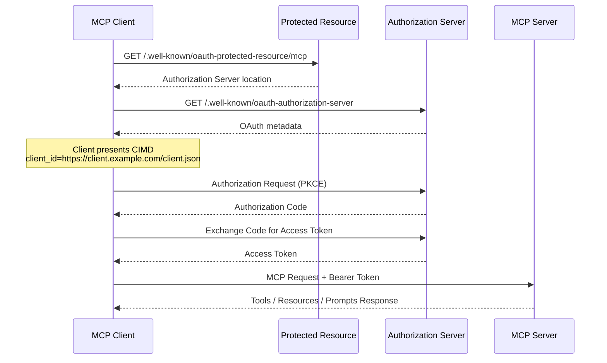

# 🧠 Model **Context** Protocol (MCP)

The **Model Context Protocol (MCP)** is an open standard that defines how AI models—especially LLMs—connect to external data sources and APIs. It enables the creation of intelligent agents and complex workflows by providing structured **context** to AI applications.

### 🔗 Key Highlights
- A **standard protocol** for connecting AI models to **external data sources** and APIs.
- Enables AI applications to provide **context** to LLMs in a consistent, reusable way.
- Facilitates building **agents and workflows** on top of LLMs.
- Allows models to **read data** and **execute actions** via a universal connector.

### 🔗 Transport Mode
```python
# local communication
mcp.run(transport="stdio")
# remote network communication
mcp.run(transport="http", port=8000)
```

### 🔗 Session State
```python
mcp = FastMCP("My MCP Server", auth)
```
  
📖 **Reference**: [modelcontextprotocol.io/introduction](https://modelcontextprotocol.io/introduction)

---

## 🧩 MCP Primitives

MCP defines a set of **primitives**—building blocks that clients and servers can expose to each other.

### 🔧 Server-Side Primitives
Servers can expose the following core primitives:

- **🛠 Tools**  
  Executable functions that AI applications can invoke to perform actions  
  _Examples: file operations, API calls, database queries_

  ```python
  @mcp.tool()
  def search_flights(origin: str, destination: str) -> dict:
      """Search for flights between two airports"""
      return {
          "flights": [ {"id": "FL123", "origin": origin, "destination": destination, "price": 299} ]
      }
  ```

- **📚 Resources**  
  Data sources that provide contextual information to AI applications  
  _Examples: file contents, database records, API responses_
  ```python
  @mcp.resource("file://airports")
  def get_airports():
      """Get list of available airports"""
      return {
          "LAX": {"name": "Los Angeles International", "city": "Los Angeles"},
          "LHR": {"name": "London Heathrow", "city": "London"}
      }
  ```

- **📝 Prompts**  
  - Reusable templates that structure interactions with language models
  - AI guidance templates for interactions
  _Examples: system prompts, few-shot examples_

Each primitive supports:
- `*/list` – Discover available primitives
- `*/get` – Retrieve specific primitive data
- `tools/call` – Execute a tool (where applicable)

---

### 🤝 Client-Side Primitives
Clients can also expose primitives to enable richer interactions initiated by servers:

- **💬 Elicitation**  
  Servers can request additional information or confirmation from users via `elicitation/request`.

---

## 🧩 MCP Inspector

```bash
npx @mcpjam/inspector@latest

# mcp-remote + Inspector > local(stdio) to remote mcp client connection
npx @modelcontextprotocol/inspector npx -y mcp-remote@latest https://mcp.deepwiki.com/mcp

# Remote Server
npx @modelcontextprotocol/inspector --verbose --url https://mcp.deepwiki.com/mcp 
```

If your client (ex claude free version) does not yet support remote MCP servers, you can use try this local - remote proxy.
```json
{
	"mcpServers": {
		"deep-wiki": {
			"command": "npx",
			"args": ["mcp-remote@latest", "https://mcp.deepwiki.com/mcp"]
		}
}
```

---

## 🧩 MCP Security
- [Auth for MCP](https://auth0.com/ai/docs/mcp/auth-for-mcp)
- [Understanding Authorization in MCP](https://modelcontextprotocol.io/docs/tutorials/security/authorization)
- [Curity - Implementing MCP Authorization for APIs](https://curity.io/resources/learn/implementing-mcp-authorization-apis/)

---
## 🔐 MCP Authorization

### Client ID Metadata Document (CIMD)

For Remote MCP authorization, OAuth clients can identify themselves using a Client ID Metadata Document (CIMD).

Example:

```text
client_id=https://client.example.com/client-metadata.json
```

The metadata document contains OAuth client information such as:

```json
{
  "client_id": "https://client.example.com/client-metadata.json",
  "redirect_uris": [
    "http://localhost:3000/callback"
  ],
  "grant_types": [
    "authorization_code"
  ],
  "token_endpoint_auth_method": "none",
  "jwks_uri": "https://client.example.com/jwks.json"
}
```

**Benefits**

- No dynamic client registration required
- Client metadata hosted by the client itself
- Better interoperability for MCP clients
- Enables trust through signed metadata and JWKS

### Authorization Discovery Endpoints

**Protected Resource Metadata**

```text
GET /.well-known/oauth-protected-resource/mcp
```

Returns information about the Authorization Server protecting the MCP resource.

**Authorization Server Metadata**

```text
GET /.well-known/oauth-authorization-server
```

Returns OAuth configuration such as:

- authorization_endpoint
- token_endpoint
- grant_types_supported
- code_challenge_methods_supported

### MCP Authorization Flow


### MCP Authorization Flow (with CIMD)




### Key Idea

Remote MCP authorization relies on standard OAuth 2.0:

1. Discover the protected resource metadata.
2. Discover the authorization server metadata.
3. Present a Client ID Metadata Document (CIMD).
4. Complete the OAuth Authorization Code + PKCE flow.
5. Obtain an access token.
6. Call MCP tools, resources, and prompts using the bearer token.

Unlike traditional OAuth applications, MCP clients can identify themselves through a hosted Client ID Metadata Document rather than requiring pre-registered client credentials.
---
Reference - MCP Explorer

- https://mcp.azure.com/ - helps in testing MCP Server
- https://code.visualstudio.com/mcp
- [Azure MCP Server](https://learn.microsoft.com/en-us/azure/developer/azure-mcp-server/tools/)
- [GitHub Remote MCP Server](https://github.com/github/github-mcp-server)
- [mcp-for-beginners](https://github.com/microsoft/mcp-for-beginners)
- [modelcontextprotocol/python-sdk](https://github.com/modelcontextprotocol/python-sdk)
- [Creating Your First MCP Server](https://www.youtube.com/watch?v=44SUYJ9fqxs)

## Explored MCP Servers
- [chrome devtools](https://developer.chrome.com/blog/chrome-devtools-mcp)
- https://gofastmcp.com
- https://www.mcpjam.com/
